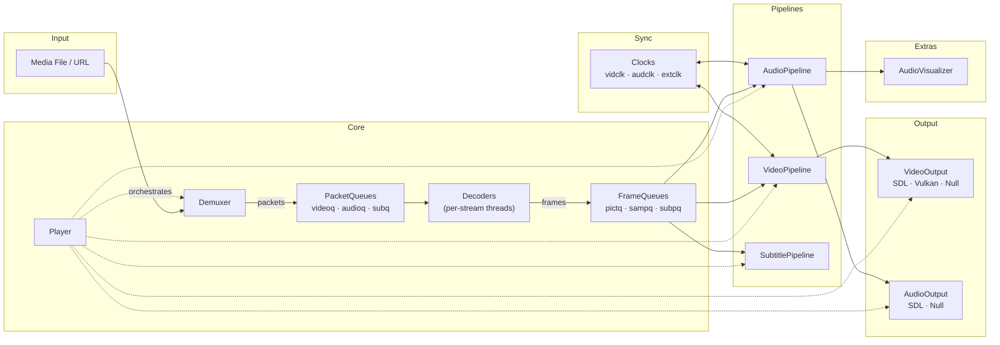

# FFplay C++

A C++23 rewrite of FFmpeg's ffplay media player with Vulkan-accelerated rendering.

[](https://github.com/aniuzhong/ffplay-cpp/actions/workflows/ci.yml)

## Architecture



## Build

```bash
# Windows (MSVC, with Vulkan)
$env:VULKAN_SDK = "C:\VulkanSDK\1.3.xxx.x"
cmake -B build -G "Visual Studio 17 2022" -A x64

# Windows (MSVC, software-only)
cmake -B build -G "Visual Studio 17 2022" -A x64 -DENABLE_VULKAN=OFF

# Linux (Ubuntu 26.04)
cmake -B build -DCMAKE_BUILD_TYPE=Release -DENABLE_VULKAN=OFF
cmake --build build
```